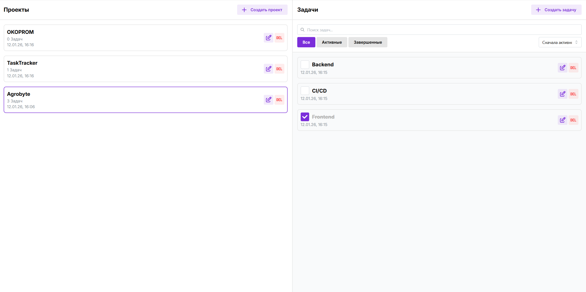

# Task Manager (Redux Toolkit + TypeScript)

Мини-приложение для управления проектами и задачами. Проект сделан как практика по  Redux Toolkit: slices, entityAdapter, selectors, listenerMiddleware, persist в localStorage и поиск с debounce.



---

## Возможности

### Projects
- Создание проекта
- Переименование проекта
- Удаление проекта
- Подсчёт количества задач в проекте
- При удалении проекта — каскадное удаление связанных задач

### Tasks
- Создание задачи в выбранном проекте
- Toggle completed
- Переименование задачи
- Удаление задачи
- Фильтрация: `all / active / completed`
- Сортировка: `newest / title`
- Поиск по названию (case-insensitive, частичное совпадение)
- Debounce поиска: ввод (`search`) → применённый поиск (`searchApply`) через ~300ms

### Persist (localStorage)
Сохраняются:
- выбранный проект (`selectedProjectId`)
- фильтр / сортировка
- применённая строка поиска (`searchApply`)
- (опционально) проекты и задачи — если включено сохранение в listeners

---

## Технологии

- React + TypeScript
- Redux Toolkit
  - `createSlice`
  - `createEntityAdapter`
  - `createSelector`
  - `listenerMiddleware`
- Архитектура, приближенная к FSD 
- Persist через `localStorage`

---

## Быстрый старт

```bash
npm install
npm run dev
